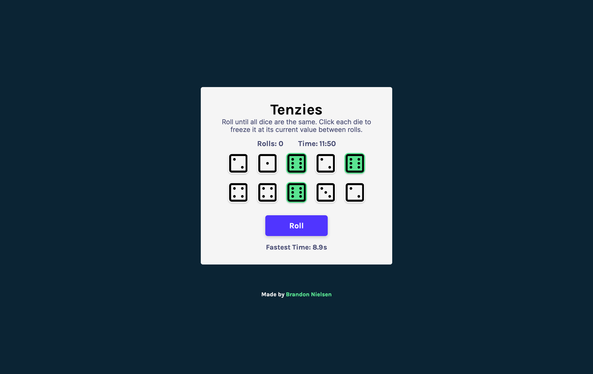
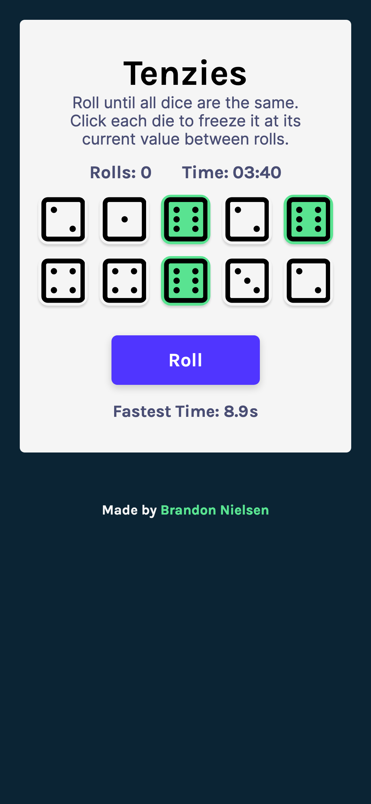
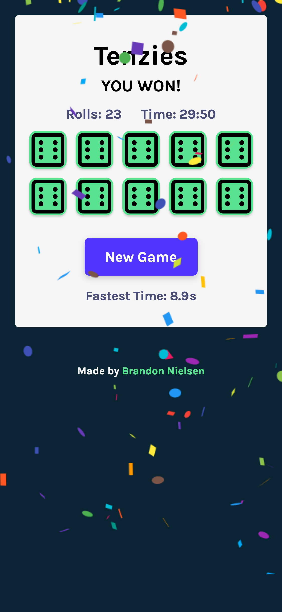

# Tenzies

## Table of Contents

- [Overview](#overview)
  - [Screenshots](#screenshots)
  - [Links](#links)
- [My process](#my-process)
  - [Built with](#built-with)
  - [Continued development](#continued-development)
  - [Useful resources](#useful-resources)
- [Author](#author)

## Overview

### Screenshots

#### Desktop

#### Mobile

  

### Links

- Solution URL: [https://github.com/bnielsencodes/tenzies](https://github.com/bnielsencodes/tenzies)
- Live Site URL: [https://bnielsen.dev/tenzies](https://bnielsen.dev/tenzies)

## My Process

### Built with

- React
- Create React App
- Semantic HTML5 markup
- Flexbox
- Grid
- Mobile-first workflow

### Continued development

- ~~Add real dots to the dice, rather than numbers~~
- ~~Track the number of rolls~~
- ~~Track the time it took to win~~
- ~~Save your best time to local storage~~

### Useful Resources

- Font Awesome for dice icons - [Font Awesome](https://www.fontawesome.com)

## Author

- Website - [Brandon Nielsen](https://www.bnielsen.dev)
- LinkedIn - [Brandon Nielsen](https://www.linkedin.com/in/bnielsencodes)
- Twitter - [@bnielsencodes](https://twitter.com/bnielsencodes)
- Frontend Mentor - [@bnielsencodes](https://www.frontendmentor.io/profile/bnielsencodes)
